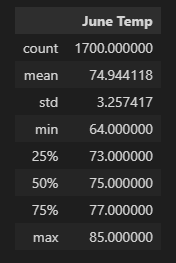
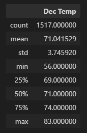

# Surf's Up
Advanced Data Storage and Retrieval

## Project Overview
Analyze the temperature trends for the months of June and December in Oahu, in order to evaluate the year-round sustainability of a surf and ice cream shop business, using Python, Pandas, SQLite and SQLAlchemy for this analysis.

### Resources
- Softwares : [Python](https://www.python.org/downloads/windows/),&nbsp; [Pandas](https://www.anaconda.com/products/distribution),&nbsp; [SQLite](https://docs.python.org/3/library/sqlite3.html),&nbsp; [SQLAlchemy](https://docs.sqlalchemy.org/en/14/intro.html),&nbsp; [Flask](https://flask.palletsprojects.com/en/2.1.x/tutorial/database/)
- Data : [hawaii.sqlite](hawaii.sqlite)
- Analysis : [SurfsUp_Challenge.ipynb](SurfsUp_Challenge.ipynb)

## Results
This project was consist of two technical analysis:
- The Summary Statistics for June
- The Summary Statistics for December

 

<table align="center" style="border-style: hidden;">
  <tr>
    <td></td>
    <td> </td>
    <td></td>
  </tr>
 </table>

 

- June temperatures range from 64 to 85 degF whereas December Temps range from 56 to 83 degF. 
- The average temperature in June is 75 degF whereas in December it is 71 degF. Also 50% of June and December temperatures are above 75 and 71 degF respectively. 
- Temperature in December are more spread out than in June since the standard deviation for December temperatures is higher.

## Summary
The temperatures in December are slightly lower than June but suitable for a surf and ice cream shop business, and the most active station for June and December can be find by following analysis:  
- session.query(Measurement.prcp).filter(Measurement.station == 'USC00519281').filter(extract('month', Measurement.date) == 6).all()
- session.query(Measurement.prcp).filter(Measurement.station == 'USC00519281').filter(extract('month', Measurement.date) == 12).all()

 
 

